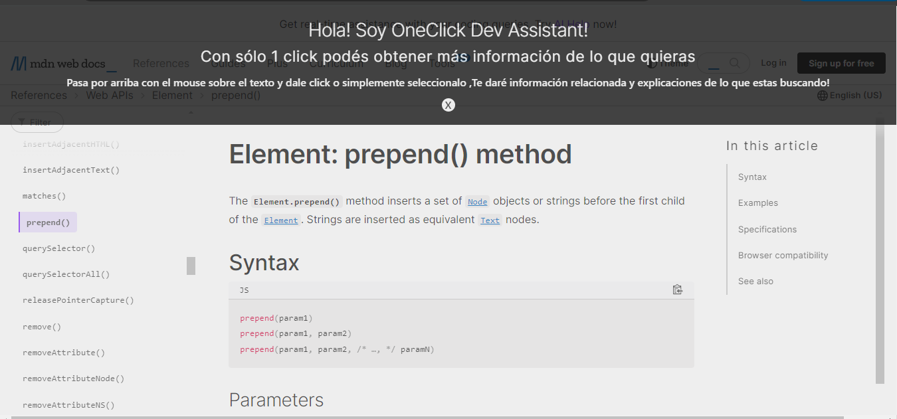

# 🌟 OneClick Assistant 🌟

## 📖 Descripción

### ¿ Pensaste en tener la información que necesitas con tan sólo 1 Click ?

Esto es lo que hace literalmente la extensión de chrome OneClick Assistant.

### ¿Cómo funciona?

  accede al sitio web que estés navegando y te ayuda a comprender y obtener mas información sobre temas relacionados principalmente con el desarrollo web o de software, además responde en español.

### ¿Como empiezo a usarla?

Muy fácil, al pasar el mouse por sobre la página aparecerá un recuadro gris seleccionado el bloque de texto donde estas situado.
Ahi tenes 2 opciones:

> 1- Hacer click y obtener informacion de todo el texto

> 2- Selecionar una palabra o frase y soltar 

En la parte superior aparecerá en unos segundos la información generada por un LLM utilizando el SDK de Vercel IA

## 🚀 Instalación

Clona el repositorio de github     
> git clone git@github.com:marianoGarmendia/one-click-assistant.git

 Ve a tu navegador, haz click en los 3 puntos superior derecha :

 * Extensiones > Administrar extensiones

* Cargar extensión sin empaquetar

* Carga la carpeta que clonaste

---

## ✨ Empezar

Ve a tus extensiones y haz click en `OneClick Assistant`

🤝 Ya podés empezar a usarla!

## 🛠️ Tecnologías Utilizadas
* Javascript
* Node.js
* Express
* SDK Vercel IA

---

## 📬 Contacto
* Nombre: Mariano Garmendia
* Correo: `contacto@marianodev.site`
* LinkedIn: https://www.linkedin.com/in/mariano-garmendia-dev/

